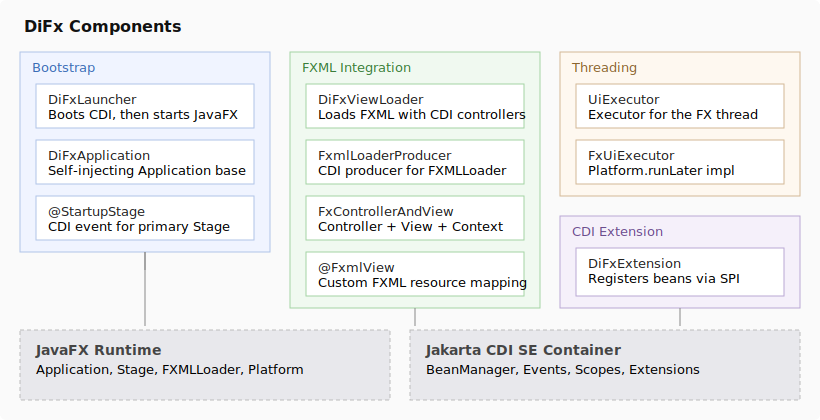
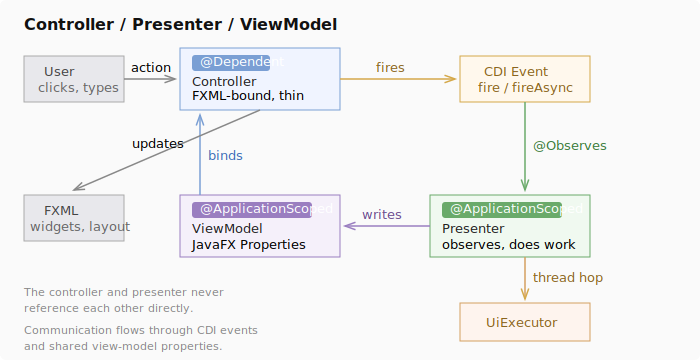

# DiFx

CDI dependency injection for JavaFX. The missing piece to make Desktop Development Awesome!

DiFx wires a Jakarta CDI SE container into JavaFX's lifecycle so your controllers, presenters, and services are proper managed beans. `@Inject`, custom scopes, Sync/Async events, interceptors, all of it should work. It's a portable CDI extension, so it works with OpenWebBeans and (in theory, haven't tested) Weld, or any other spec-compliant container.

## The Project: DiFx

***D***ependency ***I***njection Java***Fx*** = **DiFx**

Honestly I couldn't think of a better name. Adam Bien already claimed AfterBurrner.Fx (what a sick project name).

### The Why

JavaFX's `FXMLLoader` normally instantiates controllers by plain-ole reflection. Oof. You get a bare object and that kinda stinks to wire everything by hand. The usual workarounds (service locators, static holders, framework-specific hacks) create a bunch of work. It'd sure be nice to have all of the conveniences of CDI!

DiFx plugs into `FXMLLoader`'s controller factory so that every `fx:controller` class, including nested `fx:include` controllers, is resolved from the CDI container. Your controllers are real beans. You `@Inject` your dependencies, observe CDI events, and let the container handle lifecycle management.

Whats nice is once you have CDI Facilities running in your app, you open your world to a whole host of CDI Extensions, scopes, and other useful libraries.

### Speed? Of course. Don't be ridiculous.

A full app with OpenWebBeans boots in about 100ms with moderately complicated desktop applications on my M4. There's near zero overhead with CDI; Very cheap to have a nice DI framework manage your object lifecycle for you. 

### Getting started

#### Maven

```xml
<dependency>
	<groupId>com.github.exabrial.javafx</groupId>
	<artifactId>difx</artifactId>
	<version>1.0.0-SNAPSHOT</version>
	<scope>compile</scope>
</dependency>
```

#### 1. Write a DiFxLauncher launcher

This class contains your `main(...)` method and should extend `DiFxLauncher`. If you're packaging into an executable jar this is the class that would be launched.

There's a single required override, `applicationClass()`, so DiFx knows which JavaFX `Application` class to launch once the CDI container boots. You can also optionally override `configureContainer(SeContainerInitializer)` to customize container startup: add or disable bean classes and packages, select alternatives, enable interceptors, disable discovery, set properties.

```java
import javafx.application.Application;
import com.github.exabrial.difx.bootstrap.DiFxLauncher;

public class MainMethodLauncher extends DiFxLauncher {

	public static void main(final String[] args) {
		new MainMethodLauncher().launch(args);
	}

	@Override
	protected Class<? extends Application> applicationClass() {
		return MainJavaFxApplication.class;
	}
}
```

#### 2. Write the DiFxApplication/JavaFX Application class

Extend `DiFxApplication`. You can `@Inject` fields here; they'll be resolved after the container starts but before `start()` is called.

```java
import jakarta.inject.Inject;
import com.github.exabrial.difx.bootstrap.DiFxApplication;

public class MainJavaFxApplication extends DiFxApplication {
	@Inject
	private SomeService service;

	@Override
	protected void afterInjection() throws Exception {
		service.doSomePreWork();
	}
}
```

#### 3. Observe the startup stage

If you've written a JavaFX Application before, normally the container would invoke the `start()` callback on the reflected instance so you can take control. Control is passed to you in two places: first in the previous `afterInjection()` callback before your app is fully booted, then here via `onStartup(@Observes @StartupStage Stage primaryStage)`, where you should call `show()`.

```java
@ApplicationScoped
public class ShellPresenter {
	@Inject
	private DiFxViewLoader viewLoader;

	public void onStartup(@Observes @StartupStage final Stage primaryStage) {
		final FxControllerAndView<MainController> main = viewLoader.load(MainController.class);
		primaryStage.setScene(new Scene(main.view(), 800, 600));
		primaryStage.setTitle("My App");
		primaryStage.show();
	}
}
```

#### 4. Write controllers as CDI beans

Annotate your FXML controllers with a scope (typically `@Dependent`). The controller factory resolves them from the container, so `@Inject` works alongside `@FXML`:

```java
@Dependent
public class MainController {
	@Inject
	private Event<SomeDomainEvent> domainEventBus;
	@Inject
	private SomeViewModel viewModel;
	
	// Note that JavaFX Injects these using field reflection, not the CDI Container
	// See notes further down about why @Dependent Scope is needed to make this work
	@FXML
	private Label statusLabel;
	
	@FXML
	public void initialize() {
		statusLabel.textProperty().bind(viewModel.statusProperty());
	}

	@FXML
	public void onButtonClick() {
		// Send a signal to another part of the Application, in the UI Thread:
		domainEventBus.fire(new SomeDomainEvent("clicked"));
		
		// Or, if you want it in a different thread:
		domainEventBus.fireAsync(new SomeDomainEvent("clicked"));
	}
}
```

#### 5. Use CDI events for decoupled communication

Fire domain events from controllers, observe them in presenters, write to shared view-models. Synchronous observers (`@Observes`) run on the firing thread (the FX thread). Async observers (`@ObservesAsync`) run on a container-managed thread, so use `UiExecutor` to marshal view-model writes back:

```java
@ApplicationScoped
public class SomePresenter {
	@Inject
	private SomeViewModel viewModel;
	@Inject
	private UiExecutor uiExecutor;

	// Recieve the fire(...) from above
	public void onEvent(@Observes final SomeDomainEvent event) {
		// This is observed on the UI Thread. Updates to UI Components can happen directly.
		viewModel.setStatus("handled synchronously");
	}

	// Recieve the fireAsync(...) from above
	public void onEventAsync(@ObservesAsync final SomeDomainEvent event) {
		// Observed off the UI Thread in CDI's executor pool.
		final String result = doExpensiveWork();
		
		// Updates to the UI must happen in the UI Thread
		// This sends a command back to the UI Thread for it to execute
		uiExecutor.execute(() -> viewModel.setStatus(result));
	}
}
```

#### 6. Clean up transient views

One weird quirk is that if you use `@FXML` "injections", the JavaFX framework sets the fields via property reflection. Since CDI proxies for something like an `@ApplicationScoped` bean don't pass field mutations through to proxy targets, you have two choices, those fields won't get written to the actual Instance of your CDI Beans. Bummer. This leaves us with two paths forward:

1. Always use setters on your classes. Annotate said setters with `@FXML`. The calls to the setters will proxy through to the target instances.
2. Keep field injections, but use `@Dependent` beans. This works because `@Dependent` beans aren't proxied; it's the real instances. Honestly this is a pretty natural feeling lifecycle for Desktop Applications anyway and is a good default option.

So in light of #2: `FxControllerAndView` is `AutoCloseable`. Closing it releases the `CreationalContext`, destroying dependent beans and firing `@PreDestroy`. Use this for dialogs and other short-lived views:

```java
try (FxControllerAndView<DialogController> dialog = viewLoader.load(DialogController.class)) {
	// show the dialog, wait for it to close
}
// controller and its dependencies are now destroyed
```

Another good place to use `@Dependent` is for the main shell view (shown above as `SomePresenter`) that lives the whole time; just don't close it.

### Architecture

#### What's in the box



**Bootstrap.** `DiFxLauncher` starts the CDI container, then hands off to JavaFX. The container stays open for the full application lifecycle and closes on exit. `DiFxApplication` is the `Application` base class that self-injects against the running container in `init()`, so your `@Inject` fields resolve even though JavaFX created the instance by reflection.

**Startup event.** When JavaFX calls `start(Stage)`, DiFx fires the primary `Stage` as a CDI event qualified with `@StartupStage`. Any managed bean can observe it to build the initial window. Just write `@Observes @StartupStage Stage primaryStage` on a method and you're in.

**CDI-aware FXML loading.** `DiFxViewLoader` loads an FXML file and resolves its controller (and any nested controllers) from the container. It returns a `FxControllerAndView<C>` bundling the controller, the root `Parent` node, and the `CreationalContext` so you can destroy dependent beans cleanly when the view is torn down.

**`@FxmlView` annotation.** Maps a controller class to its FXML resource. By default the loader looks for `ControllerName.fxml` in the same package. Annotate with `@FxmlView("custom.fxml")` to override.

**`UiExecutor`.** A `java.util.concurrent.Executor` that runs work on the FX Application Thread (inline if you're already on it). Inject it into presenters and use it with `CompletionStage.thenAcceptAsync(action, uiExecutor)` to marshal results back to the UI thread. Beats scattering `Platform.runLater` calls around your codebase.

#### Suggested Class Layout

DiFx doesn't force an architecture on you, but the pieces fit naturally into a **Controller / Presenter / ViewModel** separation:



**Controller** (`@Dependent`, FXML-bound). Thin. Binds widgets to view-model properties and fires domain events on user actions. No business logic here.

**Presenter** (`@ApplicationScoped`). Observes domain events, does the actual work (or delegates to services), and writes view-model state. Uses `UiExecutor` when arriving from a background thread.

**ViewModel** (`@ApplicationScoped`). Holds JavaFX properties. This is the shared contract between controller and presenter; neither side references the other directly.

Leverage CDI's event bus to distribute events around your application!

#### Under the hood

DiFx registers itself via `META-INF/services/jakarta.enterprise.inject.spi.Extension`. The `DiFxExtension` adds its beans during `BeforeBeanDiscovery`, so they're available regardless of the application's discovery mode. DiFx's own jar uses `bean-discovery-mode="none"` so these types are registered exactly once through the extension, not picked up again by classpath scanning.

`FxmlLoaderProducer` is a `@Dependent` CDI producer that creates single-use `DiFxFxmlLoader` instances, each wrapping a `FXMLLoader` with a controller factory backed by `BeanManager.getReference()`. All controllers resolved during a single FXML load share one `CreationalContext`, so they can be destroyed together when the view is torn down.

### Requirements

- Java 25+
- Jakarta CDI 4.0+
- JavaFX 25+
- A CDI SE container implementation (OpenWebBeans, Weld SE, etc.)

### License and other boring legal notes

* All files in this project are copyrighted
* All Fiels in this project are licensed under the terms of the EUPL-1.2
* This license allows you to safely use unmodified/un-extended code in closed-source commercial projects, without revealing your company's proprietary application code in most cases.
	- However: Note that if you modify/extend DiFx, distribute it, and/or offer online access to apps through a modified/extended DiFx, it is required by law that the source code for your DiFx changeset be made available _first_, before offering said access to your app or distribution.
	- Again, this does not include your proprietary application source code, just the changeset to DiFx.
* Java, JavaFX, Apache, Weld, OpenWebBeans, and many other names are trademarks; this project is not endorsed by nor affiliated with them.
